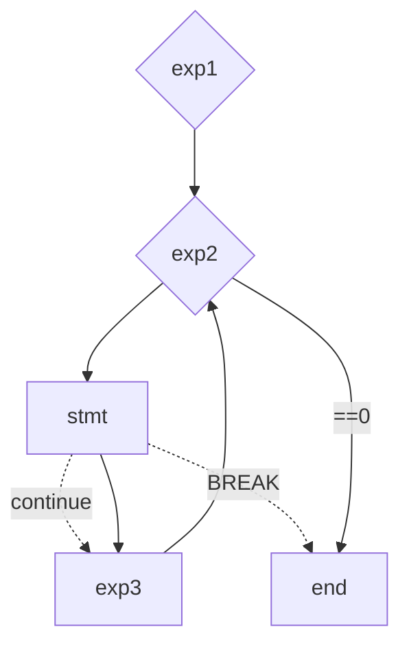

# 分支和循环

------

[TOC]

------

C语言一共有顺序、选择、循环三种结构。顺序结构没什么好介绍的，选择结构在C语言中体现为分支语句，循环结构在C语言中体现为循环语句，接下来主要介绍选择和循环两种结构。

## 1. 分支语句（选择语句）

分支语句只要分为两类，一类是if语句，一类是switch语句，主要都是实现选择的功能。

### 1.1 if语句

if语句的第一种语法结构为：

```c
if (表达式)
    语句;           //如果表达式为真，则执行语句；反之则不执行
```

第二种结构为：

```c
if (表达式)
    语句1;
else
    语句2;         //如果表达式为真，执行语句1；反之执行语句2
```

第三种结构为：

```c
if (表达式1)
    语句1;
else if (表达式2)
    语句2;
else
    语句3;           //如果表达式1为真，执行语句1；如果表达式2为真，执行语句2；反之                        执行语句3
```

```c
#define _CRT_SECURE_NO_WARNINGS 1

#include <stdio.h>

int main() 
{
	int age;
	printf("请输入你的年龄:");
	scanf("%d", &age);
	if (age < 18)
		printf("你的年龄是%d岁，未成年\n", age);
	else if (18 <= age & age <= 60)
		printf("你的年龄是%d岁，是青壮年\n", age);
	else
		printf("你的年龄是%d岁，属于老年\n", age);
	return 0;
}
```

如果说 if--else 语句需要控制多条语句，就需要使用代码块的形式了。

```c
#define _CRT_SECURE_NO_WARNINGS 1

#include <stdio.h>

int main() 
{
    if(表达式)
    {
        语句列表1;
    }
    else
    {
        语句列表2;
    }
    return 0;
}
```

这里需要注意一下**悬空else**的情况，即**else和离他最近的未匹配的if进行匹配**。比如以下代码：

```c
#define _CRT_SECURE_NO_WARNINGS 1

#include <stdio.h>

int main() 
{
    int a = 1;
    int b = 2;
    if(a == 0)
        if (b == 2)
            printf("haha\n")
    else
        print("hehe\n")
    return 0;
}
```

此处运行的结果为空。根据悬空else的原理，这个else其实是和if(b==2)进行匹配的，所以代码变为：

```c
#define _CRT_SECURE_NO_WARNINGS 1

#include <stdio.h>

int main() 
{
    int a = 1;
    int b = 2;
    if(a == 0)
        if (b == 2)
            printf("haha\n")
    	else
        	print("hehe\n")
    return 0;
}
```

### 1.2 switch语句

switch是分支当中的一种语句，专门用于实现多分支。其语法格式为：

```c
switch(整型表达式)
{
        语句项;
}
```

其中，语句项的格式为：

```c
case 整型常量表达式:
	语句;
```

示例：

```c
int main()
{
	int day;
	printf("请输入天数：");
	scanf("%d", &day);
	switch (day)
	{
	case 1:
		printf("今天是星期1\n");
		break;
	case 2:
		printf("今天是星期2\n");
		break;
	case 3:
		printf("今天是星期3\n");
		break;
	case 4:
		printf("今天是星期4\n");
		break;
	case 5:
		printf("今天是星期5\n");
		break;
	case 6:
		printf("今天是星期6\n");
		break;
	case 7:
		printf("今天是星期日\n");
		break;
	}
	return 0;
}
```

对于以上示例程序，switch语句的入口在于day，day等于多少就直接从对应的case入口进入，退出则是从break退出；如果不加break，则执行当前的case之后还会继续执行后面的case，直到碰到break才退出switch语句。

示例2：

```c
int main()
{
	int day;
	printf("请输入天数：");
	scanf("%d", &day);
	switch (day)
	{
	case 1:
	case 2:
	case 3:
	case 4:
	case 5:
		printf("今天是工作日\n");
		break;
	case 6:
	case 7:
		printf("今天是休息日\n");
		break;
    default:
		printf("输入错误\n");
		break;
	}
	return 0;
}
```

default处理的是case之外的情况，**随意放在哪里，建议放在case之后**。

## 2. 循环语句

C语言中循环有三种，分别是while循环，for循环以及do while循环。

### 2.1 while循环

```c
while (表达式)
	循环语句;
```

示例：打印1-10

```c
int main() 
{
	int num = 1;
	while (num <= 10)
	{
		if (num == 5)
			continue;
		printf("%d\n", num);
		num++;
	}
	return 0;
}
```

这里需要注意一下continue与break。循环碰到break，循环结束；循环碰到continue，本次循环结束，即跳过continue之后的代码不执行，直接跳到循环初始入口，进行下一次循环的入口判断。

### 2.2 for循环

```c
for (表达式1; 表达式2; 表达式3)
    循环语句;
```

**表达式1**称为初始化部分，用于初始化循环变量的。**表达式2**称为条件判断部分，用于判断循环时候终止。**表达式3**称为调整部分，用于循环条件的调整。

示例1：

```c
int main()
{
	for (int i = 1; i <= 10; i++)
	{
		printf("%d\n", i);
	}
	return 0;
}
```

#### for循环执行流程介绍：



#### 关于for循环的一些建议：

- 不可在for循环体内修改循环变量，防止for循环失去控制

    ```c
    int main()
    {
        int i = 0;
        for (i=0; i<10; i++)
        {
            if (i = 5)
                printf("haha\n");
            printf("hehe\n");
        }
        return 0;
    }
    ```

    这里面在循环体内if语句将变量i改变了，因此循环失去了控制

- 建议for循环语句到的循环控制变量的取值采用"**前闭后开区间**的写法"

    ```c
    int main()
    {
        int i = 0;
        int arr[10] = {1,2,3,4,5,6,7,8,9,10};
        for (i=0; i<10; i++)
        {
            printf("%d", arr[i]);
        }
        return 0;
    }
    ```

    这里0为闭，10为开

#### for循环的一些变种形式：

- for循环的初始化、调整、判断都可以省略。但是for循环的判断部分如果被省略，那判断条件则恒为真。

    ```c
    int main()
    {
        int i = 0;
        for (; ;)
        {
            printf("haha");
        }
        return 0;
    }
    ```

- for循环内同时使用两个循环变量的情况

    ```c
    int main()
    {
        int x, y;
        for (x=0, y=0;x<2 && y<5; ++x,y++)
        {
            printf("haha");
        }
        return 0;
    }
    ```

### 2.3 do...while()循环

```c
do
{
    循环语句; 
}
while (表达式);
```

当表达式为真时，执行do里面的代码块，反之则跳出循环。其循环体至少执行一次，使用的场景有限，因此不是经常使用。

